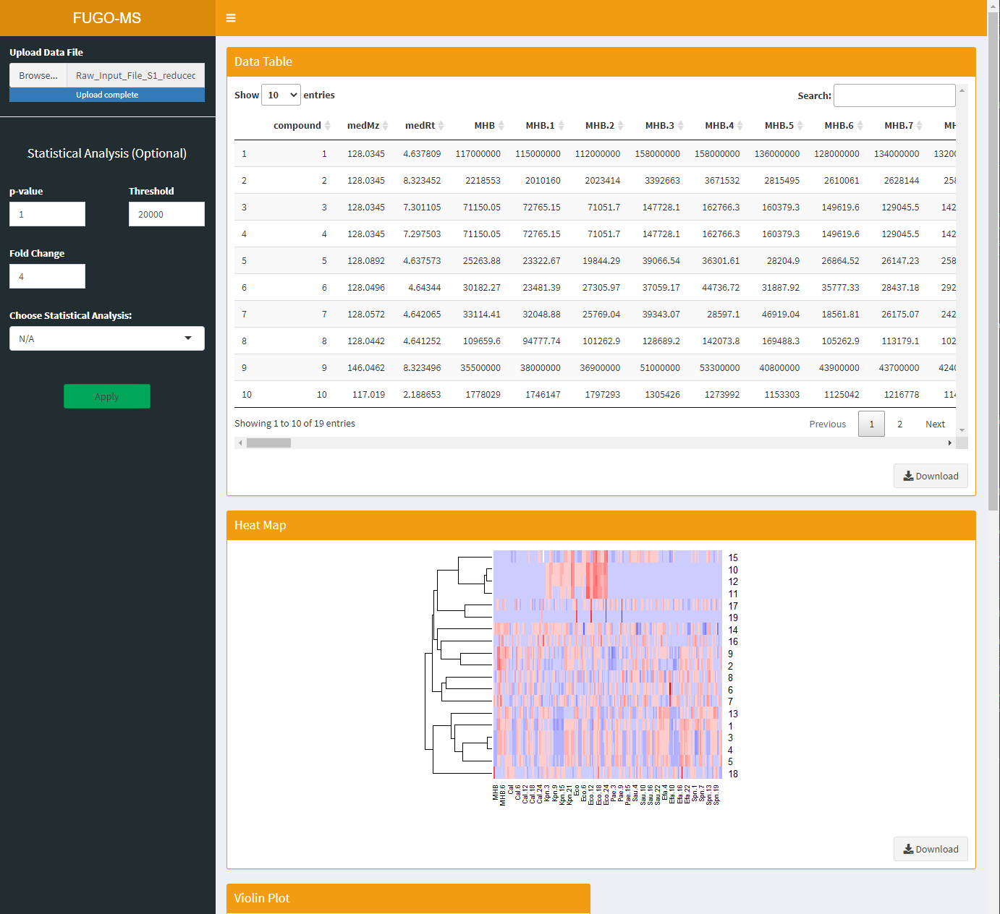

# FUGO-MS
Filtering utility for grouping untargeted mass spectrometry datasets 

## FUGO-App

To deploy the application locally, the user must have R and the Shiny package installed.

`install.packages('shiny')`

Then, to run the app, simply open an R console, set the directory to one that includes `app.R` and deploy the app.

`setwd("~/FUGO-MS")`

`runApp()`

This will launch a local instance of the app on the user's machine.
