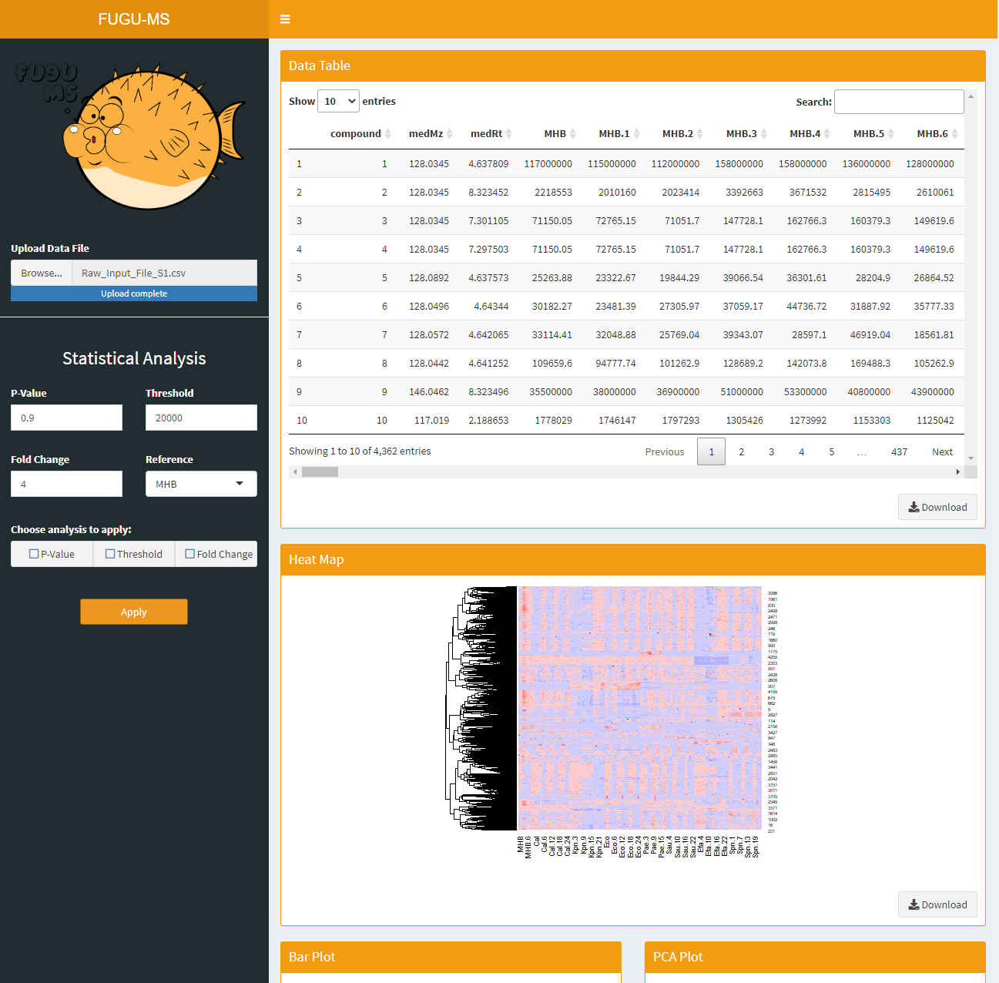

# FUGU-MS
Filtering utility for grouping untargeted mass spectrometry datasets.


## FUGU-App



To deploy the application locally, the user must have R and the following packages installed.

```
install.packages('shiny')
install.packages("shinyWidgets")
install.packages("shinybusy")
```

Then, to run the app, simply open an R console, set the directory to the project folder, and deploy the app.

```
setwd("~/FUGO-MS")
runApp()
```

This will launch a local instance of the app on the user's machine.
